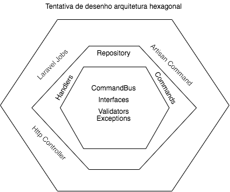

<hr>

Olá pessoal, é um prazer fazer este desafio! 

Gostaria de agradecer a oportunidade.

Desafio: https://www.notion.so/Desafio-Boltons-f40fd110d22a4fa3a6f8eb38defb62d1
<hr>
Setup (mac/linux):

-   1 - dê permissão no setup.sh com chmod +x setup.sh - Este script vai fazer todo o setup necessário e vai deixar os containers rodando em background.
-   2 - crie um host no /etc/hosts de arquivei.local para 127.0.0.1
-   3 - acesse arquivei.local no seu browser, o app estará pronto para uso.

Fiz um artisan command que sincroniza as notas que contempla os itens 1 e 2 do desafio, para rodar utilize:

docker-compose exec fpm php artisan arquivei:api:sync:nfe --status=received

## Explicando o command:
Eu tentei utilizar arquitetura hexagonal, por não ter experiência não sei se ficou certo ou errado, mas o resultado final ficou bem legal.

Quando o comando é executado, ele schedula um job que vai ler a primeira página da api.

Este job parseia o xml pegando valor total e insere no banco local.

Quando ele parsear toda a data da response, ele irá schedular o mesmo job, só que com a url next do objeto page da response.

Isto será feito até a data estiver com count igual a zero.

Com isto, acredito que o proposto estará feito, que é sincronizar todas páginas de nfe com o banco local.

No item 3, é dito que tem de ser feito um endpoint que retorna o valor da nota com base na chave, entretanto não informou se é do banco que foi sincronizado, ou direto da api, então fiz o seguinte:

> Se a chave da nota não estiver no meu banco local, eu bato na api, sincronizo unitariamente aquela nota e retorno o valor pro usuário, paralelamente é cacheado num redis, já que este valor é imutável, é cacheado eternamente.

Também implementei um rate limit nesse endpoint que permite 100 requests/min igual a api do arquivei, caso seja ultrapassado, será colocado na fila de retry (fiz um teste unitário disso).
<hr>

Foram utilizados neste desafio as seguintes tecnologias:

-   Php 7.3
-   Docker
-   Laravel 7.24
-   Sqlite
-   Redis para fila e cache
-   PSR-12
-   ( no desafio não mencionava se precisava de autenticação no endpoint que consulta valor por chave de acesso, deixei publico, mas poderia ter utilizado JWT ou OAUTH).

Utilizei o queue driver como redis, mas poderia ter utilizado um beanstalkd da vida ou um sqs como gerenciador de filas.

O readme está em português mas o projeto é 100% feito em inglês.

Fiz alguns testes unitários que são:

-   1 - Teste que valida a busca por access key, caso não exista no banco local, sincroniza com o atual validando se a chave é valida, caso não for, retorna um erro padrão.
-   2 - Teste que valida o rate limit ( too many requests ) da api.

#### Não consegui pensar em muitos testes, mas os dois acima contemplam os itens 1,2 e 3.

Para rodar os testes utilize docker-compose exec fpm php artisan test

Arquitetura:



Vídeos do funcionamento:

-   1 - Comando que sincroniza notas e insere no banco -> https://recordit.co/8L9MguKMNk
-   2 - Endpoint retornando valor de uma chave que não existe no banco e inserindo unitariamente -> https://recordit.co/wRgKBf18pl
-   3 - Endpoint retornando valor de uma chave que existe no banco/cache -> https://recordit.co/XWQgFurqQM

<hr>

Curl p/ importar no postman:

```curl --location --request GET 'http://arquivei.local/api/nfe/35171130290824000104550000000158651247375232'```
<hr>

Também registrei no kernel para executar o command de sync nfe a cada hora.

Eu costumo usar algumas lib`s de auditoria (apm) para monitorar exceptions, no meu atual trabalho utilizo sentry, mas já utilizei bugsnag também.

Mesmo que eu não passe gostaria de reforçar que adorei o desafio, muito obrigado!

Aqui vai um axé que eu bolei enquanto fazia esse desafio:

É o novo som de salvador, é o novo som de salvador, ARQUIVEI ARQUIVOU!!!

[Arquivei Arquivou](https://www.youtube.com/watch?v=ah2HGFQppzg)

Valeuuuuuuuuuuuuuuuuuuuuuuuuu!

#### ps: tem um easter egg na view welcome :D.
<hr>
Não sei muito sobre arquitetura hexagonal, porém li bastante sobre e tentei fazer usando algumas práticas, para isto vi a seguinte palestra abaixo:

https://www.youtube.com/watch?v=6SBjKOwVq0o

https://fideloper.com/hexagonal-architecture


